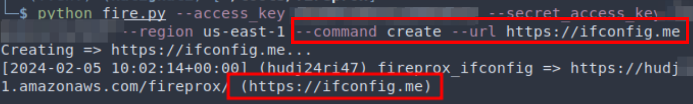
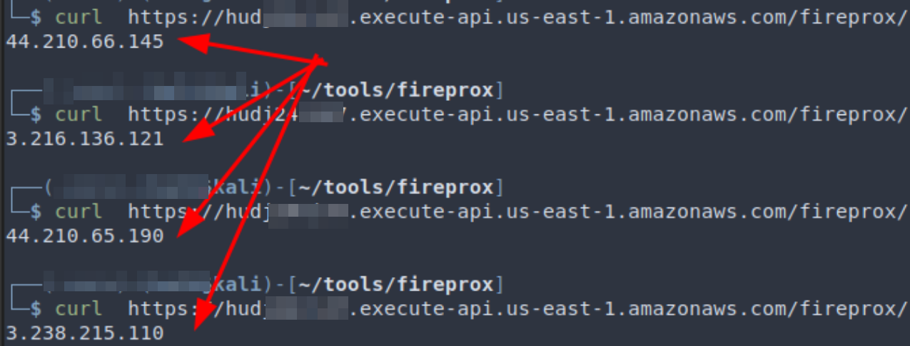

+++
title = "Why Sneak When You Can Walk Through the Front Door – A Love Letter to Password Spraying Against M365"
date = 2024-05-02
tags = ["azure", "cloud-red-team", "initial-access"]
+++

In 2023 through 2024, JUMPSEC's red team gained access to Microsft 365 (M365) environments of sophisticated clients during adversarial engagements with an approach that breathes life into the decades-old technique of password spraying. With threat actors increasingly using similar approaches in the wild, being able to compromise the even likes of *[Microsoft themselves](https://www.microsoft.com/en-us/security/blog/2024/01/25/midnight-blizzard-guidance-for-responders-on-nation-state-attack/)*, it is my opinion that red teams might benefit from incorporating some of these techniques into their initial access arsenal, or even in external perimeter security testing, to better emulate adversaries and challenge assumptions around intial access.

## Credit

Full credit needs to be given to developers of the tools and authors of the following blog posts who kindly shared their ideas. This post is heavily inspired by the work of:

- *[Teamfiltration v 3.5.3, initial v1 released in DEFCON 2022](https://www.trustedsec.com/blog/teamfiltration-v3-5-0-improve-all-the-things)* – Credits to Flangvik @ TrustedSec
- [*Fireprox, initial release in 2019*](//github.com/ustayready/fireprox) – Credits to ustrayready @ Black Hills InfoSec
- *[Graphrunner, initial release in Oct 2023](https://www.blackhillsinfosec.com/introducing-graphrunner/)* – Credits to dafthack @ Black Hills InfoSec

## Why M365?

Historically, Outlook accounts were *merely* email inboxes with impactful but limited usability, but this is no longer the case. Barring the capacity to read sensitive businesss communications and impersonate internal users to phish others in an organisation, an attacker's access to M365 accounts often lead to far more impact in hybrid or cloud-native organisations in 2024.

For example, we have multiple clients where most if not all of their business critical data now resides in SharePoint and access control is tied to M365/Azure groups. An attacker compromising an account with SharePoint access is analogous to getting access to the data of an internal file server in a traditional on-prem context. Let's say said account has read/write access to multiple business-critical SharePoint sites, then they are already analogous to being able to "deploy ransomware" in a traditional sense, if proper recovery procedures have not been implemented.

In addition, an active M365 session grants access to GraphAPI and other Microsoft cloud resources, which is a fantastic entrypoint for lateral movement and persistence in the cloud. I do encourage checking out Black Hill's incredible *[blog post](https://www.blackhillsinfosec.com/introducing-graphrunner/)* on the subject of Azure / GraphAPI lateral movement with GraphRunner if you are interested.

## The Theory Behind

### User's gonna user

So, given M365 accounts are juicy targets, how does one gain access? Besides MiTM phishing with tools like Evilginx, consider spraying your way in. The term "password spraying" refers to trying a small set of passwords (usually less than 20, or even 10 in this context) against a large number (hundreds, or more if possible) of users.

The core idea is that even in an org with a "strong" password policy in length and complexity, some users are statistically likely to set easily guessable ones like `Welcome@2024`. If an attacker can gather a large number of valid user emails (out of scope of this blog post, but there are many resources for this), they only need to target the statistically common passwords to get the highest chance to find a correct combination.

> As a side note, Welcome@YYYY, Season@YYYY, WelcomeYYYY!, Orgname@YYYY appear to be some of the highest hit rate passwords we observed in engagements.

While this is all well and good, there are 2 minor inconveniences in most modern OAuth providers in the forms of:

1. intruder identification & blocking, and;
2. user lockout.

Since we are targeting M365, we'll discuss Microsoft's implementation, **Entra Smart Lockout**, which might surprise you.

### Entra Smart Lockout

According to this *[MS announcement](https://techcommunity.microsoft.com/t5/microsoft-entra-blog/azure-ad-password-protection-and-smart-lockout-are-now-in-public/ba-p/245423)*, Smart Lockout is included in all versions of Azure AD (now called Entra ID, probably a different name in 2025?) including implementations in Office365, by default. Customisatiion of Smart Lockout settings *[requires Microsoft Entra ID P1 license or above](https://learn.microsoft.com/en-us/entra/identity/authentication/howto-password-smart-lockout)* (Licenses below P1 are stuck with default settings but Smark Lockout is still enabled). Therefore, all M365 corporate clients you encounter should have this feature turned on, and the only variation to expected would be the lockout settings.

The default settings are as the following:

- (For non-US government tenants): an account is locked after 10 failed attempts.
- The account locks again after each subsequent failed sign-in attempt.
- Lockout period is one minute at first, and longer in subsequent attempts. Microsoft does not disclose the rate at which the lockout period increases after unsuccessful sign-in attempts.

You might be thinking, where's the smart in this, seems to merely be an incremental lockout timer, no? Here's the *smart* part:

> When smart lockout locks a user account, we try our best to not lock out the genuine user. To ensure that bad actors can't gain access to a genuine user account. The following considerations apply:

- **Familiar vs unfamiliar locations are used to differentiate between a bad actor and the genuine user. They have separate lockout counters.**
- Once an account is locked out, the lockout state is synchronised across all Microsoft Entra data centers.
- After an account lockout, the user can initiate self-service password reset (SSPR) to sign in again.

And there's the fine print at the end:

> In addition to Smart lockout, our default protection analyses and identifies other signals including IP traffic and anomalous behavior. Entra ID blocks these malicious sign-ins by default and returns *[AADSTS50053 – IdsLocked error code](https://learn.microsoft.com/en-us/entra/identity-platform/reference-error-codes)*, regardless of the password validity.

### TL;DR as in, sorry I didn't read the Doc

From the Microsoft Documentations we can infer a few things:

- We need to bypass the lockout timer by spacing out attempts. *If attempts for the same user are sufficiently spaced out, the lockout timer (meaning, you won't get in even with a correct password) might not hit you, the attacker*.
- The attempts should come from different IP addresses, with minimal behavioral patterns that can be identified by Microsoft's algos.
- Unfortunately, unless our attempts come from the same city or region that the user usually logs into, their daily work routine would not reset our "unfamiliar" lockout counter.
- The AADESTS50053 error can either mean Smart Lockout kicking in, locking the user account, or default protection. Nevertheless, it means we won't get in with the correct password. That being said, *MS have an undisclosed internal timer that would reset in the latter case, or the user can unlock themselves via SSPR, so it might not be the end of the world when you see this error.*
- As said, if SSPR is on, users can unlock themselves, resulting in less disruption to the client. It is not a "get out of jail free" card though, as locking a single account may be extremely impactful if it's the wrong one. We cannot overstate the importance of getting a good understanding of offensive toolings that you're using, and having clear and open communcations with your client regarding some of these more "risky" tradecraft.

### Fireprox

While APT Midnight Blizzard was reported *[obtain intial access on Microsoft using distributed residential proxies](https://www.microsoft.com/en-us/security/blog/2024/01/25/midnight-blizzard-guidance-for-responders-on-nation-state-attack/)* to perform password spraying, red teamers can achieve a similar result by utilising the AWS API gateway service, which can (by design) serve as a proxied gateway to … API services (duh). *[Fireprox](https://github.com/ustayready/fireprox)* is a tool that creates a wrapper around the usage of this service to create a "distributed" proxy to send POST requests to login.microsoftonline.com. The next tool introduced in this blog post, Teamfiltration, also incorporates code from Fireprox in its codebase, so if you want to follow along, make sure to sort out the AWS pre-requisites here. You'd need:

- An AWS tenant that you control.
- Create a new IAM user, grant them `AmazonAPIGatewayAdministrator` privileges by attaching the policy directly in permissions. Create an access key in "Security credentials", choose "other", and save the access key ID and secret key somewhere safe.
- (Optionally) Play with Fireprox to figure out what it does.

Basically, how Fireprox works is that you generate a static AWS URL to access an endpoint through AWS's proxy. What makes it interesting is that a different egress IP address is used whenever a new request is made through that generated URL.

For example, here we created a URL starting with "hudi24ri47" that is located in the region of us-east-1, and the target is ifconfig.me. By curl-ing repeatedly, we can see the egress IP observed by the target web server is different in every single request.





> If you are concerned about costs, API gateway is billed at 100k+ API calls for single digit dollars, so volume generated from engagements, which are usually around 10k requests, never amounted to more than a couple of pennies for us.

Obviously Microsoft would see that the logins come from AWS IP addresses, but that alone has not been enough to trigger lockouts. There are also AWS specific headers that are forwarded or added by the proxy, most importantly the `X-Amz-Forwarded-For` header which is removed by Fireprox. You can easily verify this by using your own request catcher and curl with Fireprox and compare the requests received with those sent from vanilla API gateway proxies.

## Caveats & Disclaimers

Before we discuss the actual tradecraft, do note that you should seek explicit consent from your client before starting any password spraying, and preferrably start from a small user set to minimize disruption. Even if users can self-serve reset their password to unlock their accounts, locking up dozens or even hundreds of accounts, especially without your client's prior knowledge and consent, is professionally unacceptable and the sort of thing that red teamers should avoid at all cost.

To be absolutely certain about your methodology, spin up your own free (1 month trial) M365 tenant with a number of users to test your methodology before using it on real engagements, as Smart Lockout is enabled by default for all M365 tenants. In fact, when our own red team first dipped our toes into learning this, we started slow and with a lot of anxiety, even with this knowledge and clear communications with our clients. It was over the process of several engagements that we've learned in depth about how the tooling worked, the thresholds, and so on, that we are finally comfortable recommending it. Bear in mind that locking out accounts on engagements is no laughing matter, and that there is an expectation of professionalism from clients when they purchase a red team.

Another thing to recommend is to have clear communications with the client regarding what hours the password spraying occur, as some clients do not want out-of-hour password spraying. A spray in our engagements usually takes 2-3 days to complete with Teamfiltration, depending how many passwords/users we can/want to try. Fortunately it can be paused and restarted at any point.

Needless to say, you are responsible for your own actions.

### Barging in with Teamfiltration

With the caveats out of the way, let's dive in. While I write about Teamfiltration here, it is not the only tool for the job, though it is a very fine tool. Think of it as a many-in-one tool kit with user enumeration and data exfiltration, not just password spraying. If you just want password spraying with integration of AWS API gateway proxying (most of the below implemented that through Fireprox), there are a number of alternatives too:

- *[CredMaster](https://github.com/knavesec/CredMaster)*
- *[o365spray](https://github.com/0xZDH/o365spray)*
- *[Go365](https://github.com/optiv/Go365)*
- *[spraycharles](https://github.com/Tw1sm/spraycharles)*

And if you understand the concepts behind Smart Lockout, and maybe have had a read at the source code of Fireprox, it shouldn't be too hard to implement a sprayer from scratch yourself. If you do want to write one, this reference on *[M365 login error messages](https://trustedsec.com/blog/from-error-to-entry-cracking-the-code-of-password-spraying-tools)* would be a must-read in my opinion.

## Setting the tool up

Teamfiltration's author Flangvik's own *[Youtube playlist](https://www.youtube.com/watch?v=J8ohuanP2gA&list=PLxxLIupMt6nDN5bAJqBZFUpxp8Hcyzbkn&pp=iAQB)* on the its usage is a great reference on how to set up and use the tool. I'd still go through the setup briefly here. Teamfiltration is designed around red team engagements and so it stores the information (valid usernames, credentials, password spray log, etc) in a local database, because you wouldn't want to mix the sensitive details of Bank A and Retail Chain B, for example. The tool is designed for a sequential workflow of using `--enum` to find valid users, `--spray` to find valid username:password pair, and then `--exfil` to loot. The reason I go into this is that there is a little quirk of Teamfiltration — the `--spray` module does not seem to have `-user` flag (yet?) as it reads the validated users from the local database from prior runs of `--enum` which would confuse the heck out of operators who don't know this.

Beside each of your clients having their own local database, there is also the Teamfiltration profile, which is a json file that you supply to the tool everytime you run it. From an Opsec perspective it does not seem to matter much regarding client segregation, though it offers you a way to further tweak settings inbetween jobs to cater to your needs.

There are a number of optional inputs in a profile. At a minimum you need to supply:

- A set of sacrificial O365 user credentials: The user needs to be in an Azure / M365 tenant. A private MSDN / Outlook / Live account would not work. Reason behind this is that user enum works by searching for a supplied email through Teams, much like how one would message an external org tenant. This functionality doesn't work with accounts *not* associated with a tenant. Though it is called "sacrificial" it is simply used to look people up on Teams.
- AWS access and secret keys to the API gateway IAM account previously described.

Using Teams to enumerate users is approach the author recommended, but there are other available methods, such as the `--validate-msol` option which uses the GetCredentialType method and is slower. A nuance we found during our testing was that some accounts (for example, service accounts) indeed do not have a Teams license but would instead only show up on `--validate-msol`. On the other hand `--validate-login` triggers logins to check, is extremely loud and is not recommended.

For all the other profile options, you can just copy from the Github repo's template. "Proxy" here refers to a local/remote web proxy for debugging purposes only, for example 127.0.0.1:8080 shown here is the one commonly used by BurpSuite. It is completely optional.

```
{
     "pushoverAppKey": "",
     "pushoverUserKey": "",
     "dehashedEmail" : "",
     "dehashedApiKey": "",
     "sacrificialO365Username": "[email protected]",
      "sacrificialO365Passwords": "RANDOM123" ,
      "proxyEndpoint": "http://127.0.0.1:8080",
      "AWSAccessKey": "CHANGEME",
      "AWSSecretKey": "CHANGEME",
      "UserAgent": "Mozilla/5.0 (Windows NT 10.0; Win64; x64)...",
      "AwsRegions":["us-east-1", "us-west-1", "us-west-2", "ca-central-1",...]
}
```

### User Enumeration

Refer to Flangvik's video on nuances in enumerating users with Teamfiltration, but the base options with `--validate-teams` worked well for us:

```
~/tools/TeamFiltration --config ./TFconfig_client.json --enum --usernames ./names.txt --validate-teams --outpath ./TF
```

`--outpath ~/clientA/TF` – this means the results of the enumeration is saved in a database file in the stated path, which the subsequent steps would use.


User enum in action on an engagement.

### Password Spraying

```
~/tools/TeamFiltration --config ./TFconfig.json --outpath ./TF --spray --sleep-min 75 --sleep-max 90 --jitter 10 --shuffle-users --shuffle-regions --exclude exclude.txt --common-only
```


As previously explained, our goal is to not trigger Smart Lockout so that a correct credential set would get us either "Access Granted" or "MFA required" returns messages, instead of the `AADESTS50053 idslocked` error message. What has been found to work for us are these settings:

- `--shuffle-regions`:

  This seemed to be the most important, as you can see TF creates roughly 10 Fireprox endpoints in the regions you defined in the TF profile. By shuffling regions, each request comes from a different AWS georegion and the sequence is also shuffled. `--shuffle users` is to change the sequence of users being sprayed. It did not seem to affect detection but I like to keep it on too.
- `--sleep-min`

  and `--sleep-max`: It is also critical to space out your spraying rounds as this defines the min/max time interval (in minutes) between which each user is attempted again. The time is randomised a bit between the 2 values to not look regular to MS. Somewhere around 1 hour per round worked for us.
- `--jitter`:

  it defines the time (in seconds) within one round, between trying a password against any 2 users. Against there is some randomised variability to not look like a bot to MS.
- `--exclude`:

  The `AADESTS50053 idslocked` error message is something expected to appear in a small % of users (up to 5 or even 10%), even in the first spraying round. You can try to exclude these users in subsequent rounds, or not. Sometimes `AADESTS50053` locked user(s) are observed to unlock on subsequent rounds so it's not the end of the world as long as the % remains small and the client is in the loop of your actions.
- `--common-only`

  Tries the "commonly observed" passwords the author defined in the source code. Of course you can use your own but these are quite good actually.

Let's say your spraying went well and you found valid credentials, then you would be given the choice by the tool to either `--exfil` to loot right away, or do it later. I would recommend to do it right away, unless there is a compelling reason not to.


You can also see all the valid credentials you found in prior spraying in the tool.

### Wait, what about MFA?

One reason why password spraying is performed less commonly by security testers against M365 might be the prevalence of multi-factor authentication (MFA), particularly in more mature or regulated clients. At least that was my assumption when learning about all these approaches.

> I thought, why password spray an MFA-enabled client? At worst you're going to alert the defenders and at best you can prove that MFA was working as intended to protect people who had weak passwords.

Such was my assumption. What I learned later was that implementing MFA in M365 was not as simple as flipping a switch. Often times, accounts can have missing MFA requirements, for any number of reasons:

- Application / service accounts that does not support MFA usage.
- New starter who have not gotten their company device to set up MFA on, or
- Leaver accounts not deactivated, from a time when the org haven't implemented MFA yet.
- Legacy applications using M365 OAuth that the business needs, but does not support MFA.
- and so on.

So after you have found a set of valid credentials on Teamfiltration (congrats btw), you can either interactively choose to `exfil` immediately or hit `--exfil` later to loot. What TF then does is to enumerate all the known platforms and applications with those credentials and see if there are any holes in the MFA implementation.

```
~/tools/TeamFiltration --config ./TFconfig.json --outpath ./TF --exfil --all --roadtools ./TF/.roadtools_auth
```

For example, the tool would try trying:

```
Windows PC - MS Teams - invalid
Mac - MS Teams - invalid
iPhone - MS Teams - invalid
Android - MS Teams - invalid
...
Windows PC - Outlook - invalid
Mac - Outlook - MFA Hole found!
...
```

When a hole is discovered, the tool goes in, grabs the relevant access and refresh tokens that can possibly be obtained, and then exfiltrates emails, Teams chat log, Sharepoint files and so on. You could also export the tokens to be used in other tools like Roadtools or GraphRunner.

Tools such as [MFASweep](https://github.com/dafthack/MFASweep) does a very similar MFA enumeration to look for an implementation gap, given valid set(s) credentials, for various Microsoft services and platoform combinations.

### Opsec Concerns & Post Exploitation

Being stealthy is crucial for many of us red teamers, so it is reasonable to ask the question of, how loud is sending thousands of login request to a single M365 tenant? The good (and bad) news is, as of 2024, spraying low and slow (as described above) can get past Entra Smart Lockout, and even if there are a couple of `AADESTS50053 idslocked` errors along the way, the attack itself does not produce a "singular" *We are under attack from a password spray* alert under either MS's Entra ID protection or Defender for M356 by default. The repeated login attempts do appear in the logs if blue team is looking for it, but before you find any valid credentials, you should still be under the radar unless the client has custom detection rules (perhaps, >1k per day failed login attempts for the whole organisation?).

The second point is more open for discussion, even if the defenders figured out they are under some sort of distributed password spraying attack geolocated around the world, while this might heighten the alertness of the team, there seem to be little that can be done at the moment. A caveat is that as Microsoft themselves were compromised by a distributed password spraying attack, I would not be surprised if they do something soon-ish, but we shall see.

> Quoting Nikhil Mittal, a renowned voice in our community, "the loudest action you can perform with Azure or M365 in general, is authentication."

Where you could quite reliably get an alert is when a set of valid credentials are found are used authenticate to perform the post-exploitation steps. So far, the only activity that can be used to verify credentials is using them to login, so the notification on our tooling that "valid creds are found" should also be treated as alert T+0.

That is the reason why I recommended running the `--exfil`, or performing other post-exploitation actions as soon as you find any set of valid credentials. If the blue team caught on and got the user to reset their password, your hard work so far would have been for naught. On the other hand, our experience with Teamfiltration so far has been that, it takes typically minutes to download thousands of business emails, Team chat logs and hundreds of MiBs of Sharepoint data, so it is definitely worthwhile to do that first for proving impact upfront.

#### Do you have a game plan?

Another generic recommendation is to have a generic post-exploitation plan before starting the password spray. It can any of the below:

- Prepared internal phishing email & payload that you can hit send right away.
- Token-craft – figure out what post-ex tools need what sort of access and/or refresh tokens, and how to get & use them.
- Organisational Persistence with inviting your own M365 users into the client's org as guests, and registering your malicious Enterprise application to retain access even if the compromised user's been burned. GraphRunner is an incredible post-exploitation toolkit for these.

## Final word

All in all, distributed and low-volume password spraying, paired with MFA gap bruteforcing, is a valid and powerful approach for M365 initial access. While it is not expected to get you in for 100% of your clients engagements (For example, some clients have few users, and implement air-tight MFA on all of them. In those cases, social engineering would be a better bet), the approach described would be a valuable addition to most red team's toolkit, especially if the bad guys are using it effectively already.


---

*Originally published on [JUMPSEC Labs](https://labs.jumpsec.com/why-sneak-when-you-can-walk-through-the-front-door-a-love-letter-to-password-spraying-against-m365/)*
