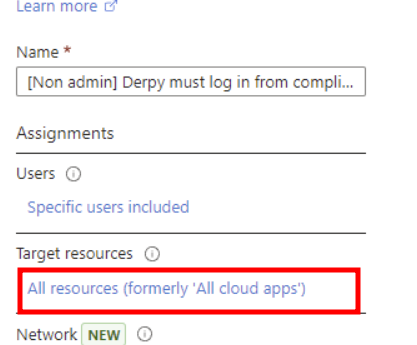
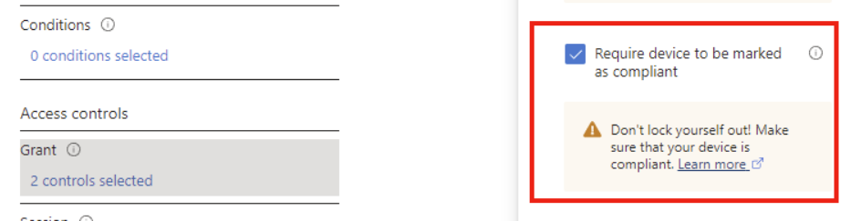
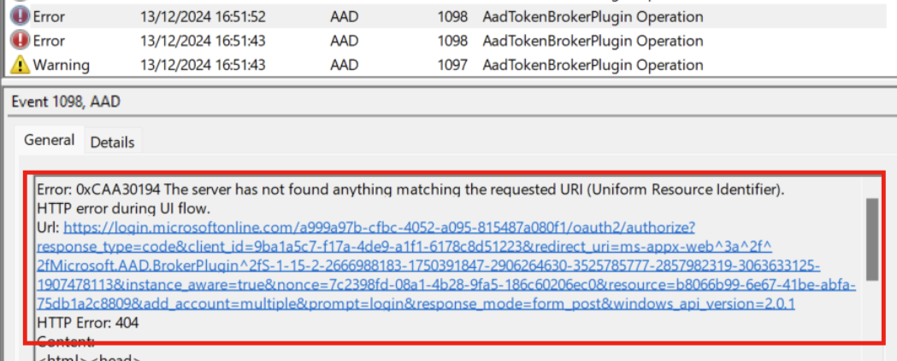
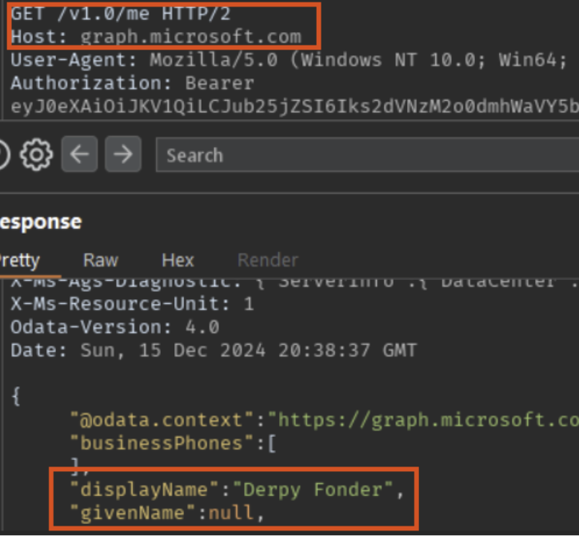
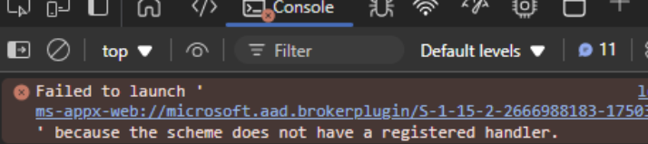
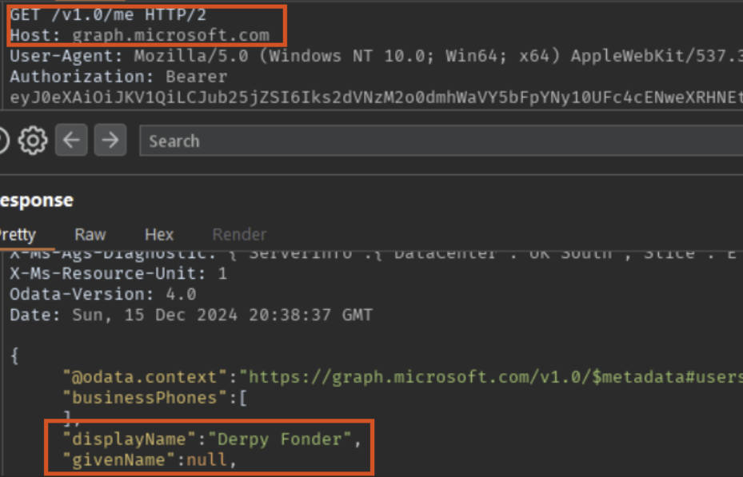
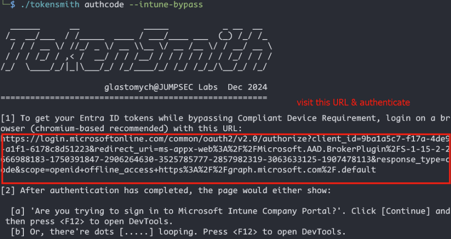
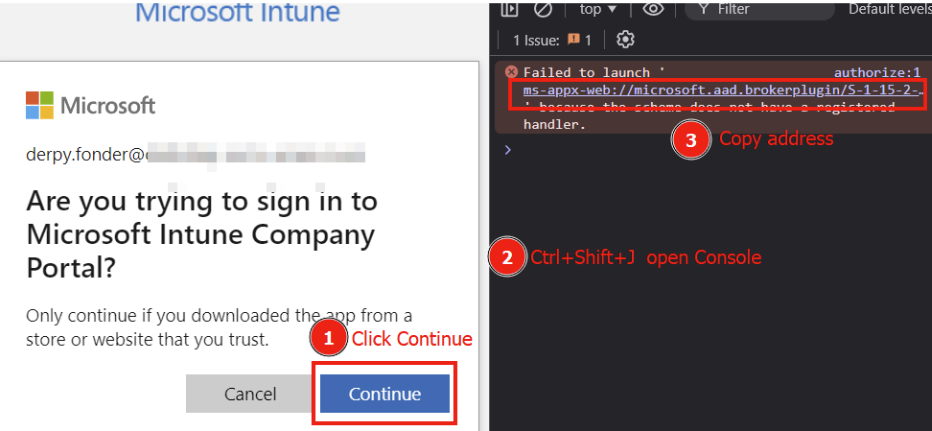
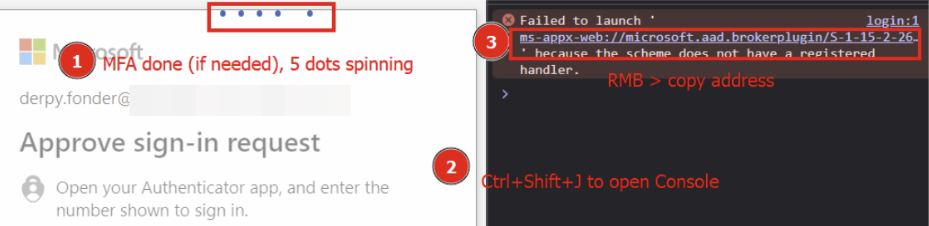
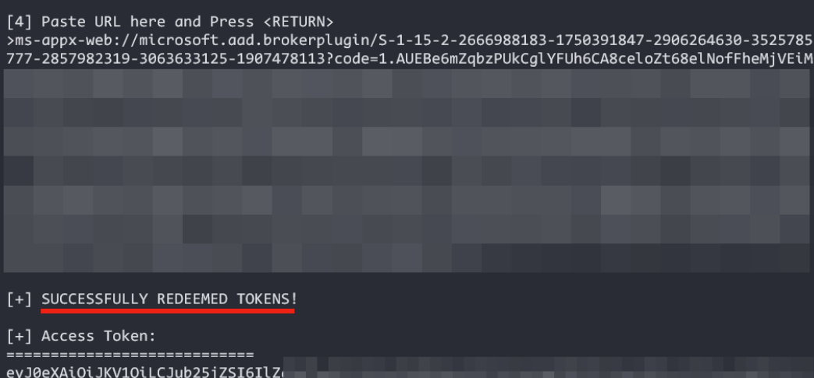

+++
title = "TokenSmith – Bypassing Intune Compliant Device Conditional Access"
date = 2024-12-20
tags = ["azure", "cloud-red-team", "initial-access", "red-teaming", "burpsuite"]
+++


Conditional Access Policies (CAPs) are the core of Entra ID's perimeter defense for the vast majority of Enterprise Microsoft 365 (M365) and Azure environments. The core ideas of conditional access are:

1. Require specific auth strength in scenarios where you wish to grant access
2. Block access in undesirable scenarios
3. If a scenario are neither covered by a or b, then the minimal auth strength (password) would be sufficient

A special condition for CAP requirements is that authentication can be required to come from an "Intune Compliant" device (also known as "company managed" to the user), otherwise the authentication would be unsuccessful. In our adversarial engagements, more hardened M365 environments often have this requirement for a large subset of cloud apps used by the company, making running post-exploitation Entra ID tools like GraphRunner, RoadRecon, Teamfiltration, etc. difficult. The conundrum is that you would need to be on a compliant device to get properly authenticated, however getting valid access & refresh token from the Endpoint device tends to be time consuming / loud, and it might not be practical to run something like GraphRunner directly on the beachhead device.

Few weeks ago in BlackHat EU 2024, [TEMP43487580](https://x.com/TEMP43487580)  (@TEMP43487580) gave a talk related to this topic. [Dirk-jan,](https://x.com/_dirkjan)  (@_dirkjan) who also previously worked on the same attack path, disclosed the relevant client ID in a tweet and mentioned looking into the *Company Intune Portal* in the same thread. According to Dirk-jan himself, the "cat is out of the bag" for bypassing the CAP auth requirement for an Intune compliant device.

```
> Client_id: 9ba1a5c7-f17a-4de9-a1f1-6178c8d51223
```

Folks in the adversarial simulation team in JUMPSEC got super excited about the possibility of getting a PoC working. I worked on this on a Friday night, helped by our Tom Ellson and a working bypass was completed based on this.

Behind the scenes I've been working on an Entra authentication util called TokenSmith for a while now. With the opportune timing of this new PoC, I decided to incorporate the bypass into the tool and release it in the current state. You can find TokenSmith on: <https://github.com/JumpsecLabs/TokenSmith>.

You can also skip the PoC sections of the post if you don't want to read about the discovery process.

## Credits

Credits for [Dirk-jan,](https://x.com/_dirkjan)  from Outsider Security & [TEMP43487580](https://x.com/TEMP43487580)  from SecureWorks for initial disclosure of the vulnerable client ID which made the subsequent work possible.

## Walkthrough of Discovery

For testing purposes, in my personal Entra ID tenant I've set up a rule called *Derpy must log in from compliant device* which requires the user Derpy Fonder to authenticate from a compliant device which is also Entra ID joined device, use MFA from all locations and most importantly, for all resources / cloud apps.





To prove that the CAP is working as intended, we tried to login to Office.com and Azure Portal, which both blocked us as we did not meet the compliance requirements. In fact there were nil compliant device in the tenant at all!


As Dirk-jan wrote the very useful RoadTx and he kindly provided the client ID of the authentication flow, first thing I tried was using his tool:

```
> roadtx interactiveauth -c 9ba1a5c7-f17a-4de9-a1f1-6178c8d51223 -u [email protected]
```

Unfortunately we would get an incorrect redirect URI error:

```
> AADSTS50011: The redirect URI 'https://login.microsoftonline.com/common/oauth2/nativeclient' specified in the request does not match the redirect URIs configured for the application '9ba1a5c7-f17a-4de9-a1f1-6178c8d51223'
```

You might wonder, what is the big deal with the direct URI? It is just another GET parameter isn't it? If you are not too familiar with the OAuth2 SSO Authorization code flow, you can see in the schematic below.


 The pre-registered SaaS application or desktop or mobile client where the IdP (Entra ID here) redirects to, needs to be **known** to the IdP first, otherwise login.microsoft.com would arbitrarily redirect their users to malicious & unknown third party domains with a legitimate authorization code with which access tokens can be redeemed. Consider the scenario where an attacker sends a user a malicious login link with the redirect_uri set to their web server, if the user logins in, would the user be redirected to the attacker's domain with the code parameter?


Fortunately, this doesn't happen as Entra ID has the record of all registered first & third party applications' legit redirect URI and would refuse to give out the authorization code (useful for later) or proceed with the redirect. Each client app with its UUID would have paired with their paired redirects, sort of like a lock-and-key situation.

Having read the MSDN manuals I do know that the nativeclient URI:

```
> https://login.microsoftonline.com/common/oauth2/nativeclient
```

is for clients like Teams, Azure PowerShell and so on. Unfortunately this is not the redirect for this '9ba1a5c7-f17a-4de9-a1f1-6178c8d51223' client. Problem is, Microsoft does not publish the redirect URIs for first party applications. I knew we only have the first half of the puzzle and if / when the correct redirection is uncovered we would have a working PoC.

Okay, on to the next hint then, Company Portal, what's that? A bit of Googling landed me on the Desktop app here: <https://learn.microsoft.com/en-us/mem/intune/user-help/sign-in-to-the-company-portal>.

And there is also a web app version at portal.manage.microsoft.com, however the client ID for the web app is not the 9ba1a5c7 one we want. I installed the Portal desktop app on a Win11 sandbox and fired it up to have a look. An Intune in-app browser prompting you to log in would pop up as soon as you start the app.


I thought, okay now I only need to proxy it to BurpSuite to see where this app talks to and it's all good then? I was so wrong. Even with Burp's cert installed into the system trusted root CA store, the app was absolutely not having it and kept throwing 404 errors. I thought then, okay let's try the builtin device code login option? The thinking was that I could route requests on a web browser through Burp during the device code flow and I could discover more there. (The guys in our team also suggested right click inspect on the in app browser which was a good shout but ultimately didn't work)


Unfortunately Entra was again not happy and device code flow was blocked from the compliant device requirement. The good news however,  is that we knew we were on the right track as the authentication attempts were indeed from the **9ba1a5c7** client ID. At least this particular App is what we need to drill further into.


And better still, we already knew the bypass would work in theory at this point as the in-app browser login was deemed **Successful** in the sign in logs, whereas the device code attempt was a Failure. The only problem was that we did not have visibility in how the authentication worked under the hood of the successful login!


## Breakthrough

The struggle with proxying the Company Portal App was real and it kept 404'ing no matter  what I tried. I even installed the Company Portal App on Linux to have a go, and the Linux version didn't even work properly. I got frustrated after a couple of hours and needed to change my thinking.

I thought, I must not be the only person trying to get this app to talk through a proxy. There has to be many legitimate corporate environments with firewalls, SSL inspection and web proxy on all internal endpoints. I Googled "Intune Company portal web proxy troubleshooting" and viola, someone was showing error logs and discussion it online:  <https://www.anoopcnair.com/fix-intune-company-portal-app-login-issues>

They posted screenshots of Windows EventViewer logs and they were super verbose, which prompted me to have a look myself on my local machine – Event ID 1098 from source AAD, and there it was, the beauty of the full sign in URL in full view:



There were a couple of encoding issues, for example %2f was turned into ^2f, presumably so that Windows would be able to process the log. I cleaned up the URL and the correct redirect URI was:

```
> ms-appx-web://Microsoft.AAD.BrokerPlugin/S-1-15-2-2666988183-1750391847-2906264630-3525785777-2857982319-3063633125-1907478113
```

I pasted the full login.microsoft.com URL into a browser and the login worked and landed on – a neverending loading screen. Of course, Brave or Firefox wouldn't know how to deal with the **ms-appx-web://** URI scheme. Nevertheless, the authorization code was returned in the redirect.


I tried to redeem the tokens using the **POST /common/oauth2/token** endpoint and it worked like a charm. Think about it, full tokens from a random web browser where compliant device check should utterly block the login! I was ecstatic. Further modifications to the sign in URL were made to make it compatible with **/common/oauth/v2.0/** and also requested for refresh tokens, scoped to MS Graph instead of just Intune, talked to MS Graph, and got AD Graph access tokens from the initial Refresh token.



> Tell you what, all those worked, and  I could not believe my eyes.

## How useful are the redeemed tokens?

Why though did all the token ops mentioned above work, and above all, why would an access token meant for Intune device enrollment be able to talk to MS Graph? On my suspicion I checked the known Foci client list on SecureWork's repo: <https://github.com/secureworks/family-of-client-ids-research/blob/main/known-foci-clients.csv>


It's right there, and the investigative part of this story was almost complete for me. For those not familiar with the term 'Foci clients', or 'family of client id' clients, refresh tokens for every cloud app in the list, which includes Teams, Az PowerShell, Az cli, and so on, could request access tokens & refresh tokens for each other (provided CAP is met). Access tokens could be requested for AD Graph and MS Graph, on top of what the App usually needs (for example, Teams would be Calendar.Read,  Contacts.Read, etc).

I double checked the sign in attempt in Entra and it further bypassed the "require hybrid Entra ID joined device" requirement on top of the Intune compliant requirement.


Authentication was successful despite not meeting the CAP grant controls.

## PoC login flow with Web requests

How would the reader recreate the same bypass at home? The requirements for the bypass is that the attacker is able to complete the authentication flow – with either:

- Password / MFA (depending on requirement), or
- Valid ESTSAUTH and ESTSAUTHPERSISTENT cookies (stolen from AiTM phishing perhaps)

And that additional CAP conditions are met, for example geolocation, device platform (User Agent), trusted IP and so on.

On a browser, hit the URL below and complete the authentication flow as usual (lines split for visibility):

```
> https://login.microsoftonline.com/common/oauth2/v2.0/authorize?\
>
> client_id=9ba1a5c7-f17a-4de9-a1f1-6178c8d51223&\
> scope=openid+offline_access+https%3A%2F%2Fgraph.microsoft.com%2F.default&\
> response_type=code&\
> redirect_uri=ms-appx-web://Microsoft.AAD.BrokerPlugin/S-1-15-2-2666988183-1750391847-2906264630-3525785777-2857982319-3063633125-1907478113
```


Once the MFA flow is completed (here for example for Derpy), the login screen would be stuck on a neverending loop with the 5 dots. The web browser is in fact trying its best to redirect you to ms-appx-web://… URL with the authorization code tagged on the end of the request.



Here you would want to fire up developer tools, hover over and copy that ms-appx-web:// link, and you would see the code= parameter in the end. If you don't want to go into developer tools to grab the URL, proxying the browser through BurpSuite would work too.


The access & refresh tokens can then be redeemed from the OAuth2 /token API endpoint like this:

**Request:**

```
> POST /common/oauth2/v2.0/token HTTP/1.1
> Host: login.microsoftonline.com
> User-Agent: Mozilla/5.0 (X11; Linux x86_64; rv:131.0) Gecko/20100101 Firefox/131.0
> Content-Type: application/x-www-form-urlencoded
> Content-Length: xxx
>
> client_id=9ba1a5c7-f17a-4de9-a1f1-6178c8d51223&redirect_uri=ms-appx-web://Microsoft.AAD.BrokerPlugin/S-1-15-2-2666988183-1750391847-2906264630-3525785777-2857982319-3063633125-1907478113&grant_type=authorization_code&scope=offline_access%20https%3A%2F%2Fgraph.microsoft.com%2F.default&code=1.AUEBe...
```

**Response:**


The token can then be used to access MS Graph (graph.microsoft.com), redeem new tokens for AD Graph (graph.windows.net) and be used to run your favorite Entra ID post exploitation tools.



## Introducing TokenSmith


An easier way to achieve the same result would be to use our recently released internal tool called [TokenSmith](https://github.com/jumpseclabs/TokenSmith). It was developed to favour a browser based authentication workflow to work with Entra ID tokens because on engagements it is often not practical to install or run an untrusted binary / PowerShell or Python scripts on a beachhead device. You can see the caveats from the repo page and how to install it as well. Basically, either grab a binary or build it from source, that's it. To get tokens where you should be blocked by Intune Compliance requirement, run:

```
> ./tokensmith authcode --intune-bypass
```

This would start the tool and it would display an appropriate URL to login with. For bypassing Intune, the client ID is fixed but you could request for resources other than MS Graph if you desire using the -r flag.



After logging in via a (recommended chromium-based)  browser you should see either one of the 2 pictures below.

**You may see this:**

If you see "Continue", **click 'Continue' once** and then press **Ctrl+Shift+J** to open the DevTools Console.



**Or you may see this instead:**

If you see the 5 spinning / flying dots, go ahead and press **Ctrl+Shift+J** open the DevTools Console.



Right click and copy the ms-appx-web URL, paste it into TokenSmith as is, press RETURN and see the tokens coming in as the tool redeems the token for you in the background.



## How do I defend against this?

The Intune Device Enrollment Service can be explicitly set on Entra ID conditional access as one of the cloud apps that must satisfy compliant device enrollment. However the dilemma is that you cannot enroll any new compliant device that way for your starters because a device must go through the **Non-compliant > Compliant** journey first via this very client. Seeing how it works it is also highly unlikely Microsoft would change the underlying functionality any time soon.

A more productive way would be to ensure that the Intune Company Portal Desktop app requires some form of MFA by conditional access by testing with running the Portal app on a VM and attempting to sign in, or by using TokenSmith. It is unfortunately not as simple as firing up the 'What if' tool in Entra ID because the 9ba1a5c7-f17a-4de9-a1f1-6178c8d51223 client is not a searchable Enterprise App in Azure.

You would have to go into the Sign In logs for a user (Entra ID admin center > Users > YourTestUser > Sign in logs) and filter for Application > 9ba1a5c7-f17a-4de9-a1f1-6178c8d51223  , and Click into the individual logins to see whether they were Successful and whether the MFA enforcing conditional access policy is applied.

## Limitations and Future Development

As explained above you must be able to authenticate to the service to get tokens (fair enough), so requiring MFA to enroll devices is a reasonable defensive measure. However, what about AiTM phishing to bypass the MFA? It would be interesting to see how AiTM phishing can factor into this, for example, if the Evilginx server can AiTM a login to Intune instead of the commonly implemented login to Office.com. Another limitation I observed is that if non-compliant devices can only get tokens for the enrollment service, trying to redeem access tokens for other clients (for example Az PowerShell) with the Refresh tokens obtained would be blocked. Though I have yet to fully explore what is possible to do using this client alone, and getting access to both MS Graph and AD Graph is already very useful indeed!


---

*Originally published on [JUMPSEC Labs](https://labs.jumpsec.com/tokensmith-bypassing-intune-compliant-device-conditional-access/)*
